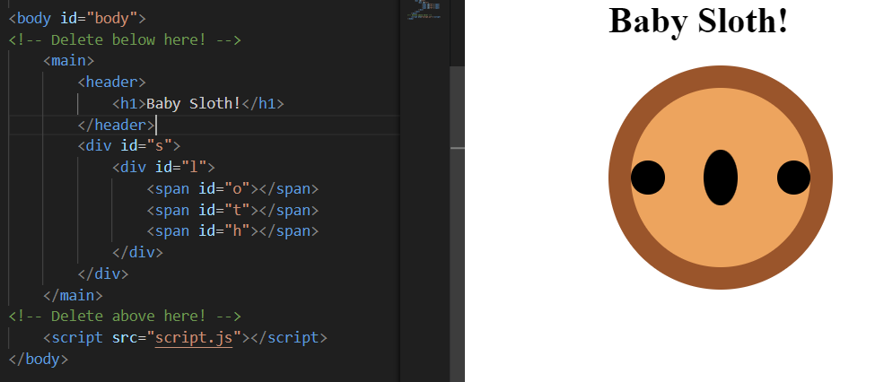
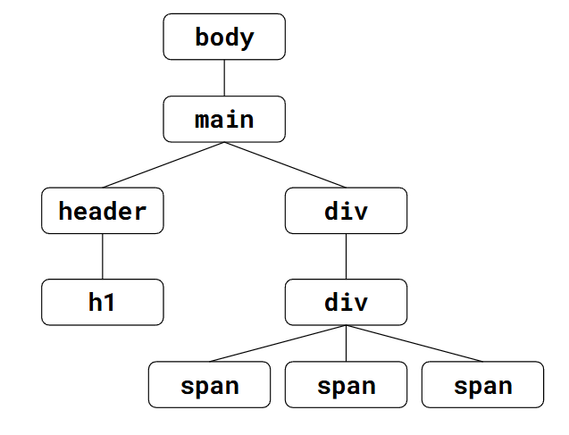

# Baby Sloth

Our job is to recreate this HTML file using only Javascript, for practice!
We start off with a preview of what the baby sloth should look like!



The HTML we are trying to replace is:
```
<main>
    <header>
        <h1>Baby Sloth!</h1>
    </header>
    <div id="s">
        <div id="l">
            <span id="o"></span>
            <span id="t"></span>
            <span id="h"></span>
        </div>
    </div>
</main>
```

Let's start by deleting the HTML between the comments, so we can practice adding DOM elements in Javascript!

### Hint:

Create elements like this:
```
let paragraph = document.createElement("p");
```

Add attributes to elements like this:
```
paragraph.id = "paragraph";
```

We need the body element, so we can append things into it!

```
let body = document.getElementById("body");
```

Append things like this:
```
body.appendChild(paragraph);
```

The DOM Tree looks like this:

